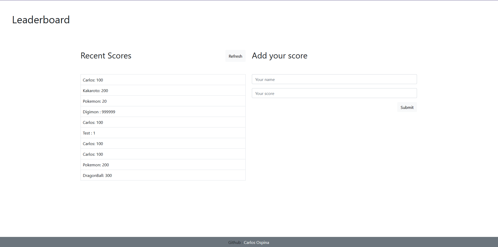

# Leaderboard

> The basic structure of the project.

Structure of the page.

## Built With

- Javascript

- CSS

- HTML

- Webpack

- VS code

- Eslint

- Stylelint

## Live Demo

[Live Demo Link](https://raw.githack.com/carloso0114/leaderboard-Js/setup-project/dist/index.html)

### Setup

- Open Terminal
- In your prefered folder, run <code>git clone `https://github.com/carloso0114/leaderboard-Js.git`</code>
- Open the `index.html` in the /dist folder to run the compiled webpack project.
- Optional: If you want to edit the project you must run:
  <code>npm i</code>
  edit the files inside /src and run :
  <code>npm run build</code>

## Authors

👤  **Carlos Ospina**

- GitHub: [carloso0114](https://github.com/carloso0114)
- LinkedIn: [Carlos Ospina](https://www.linkedin.com/in/carlosospina/)

## 🤝 Contributing

Contributions, issues, and feature requests are welcome!

Feel free to check the [issues page](https://github.com/carloso0114/Todo-List-2.0/issues).

## Show your support

Give a ⭐️ if you like this project!

## Acknowledgments

- W3School
- Bootstrap 5

## 📝 License

This project is [MIT](./MIT.md) licensed.
